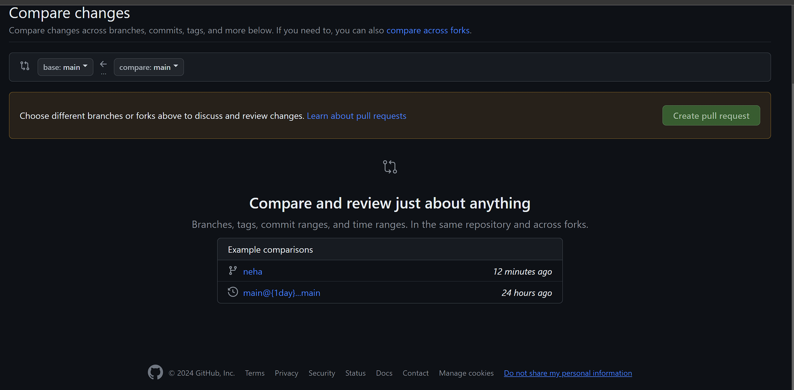
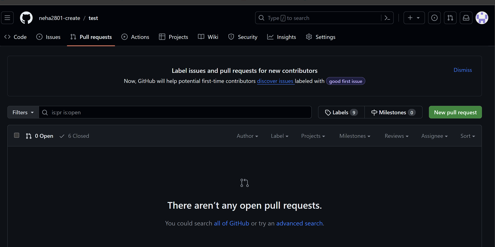
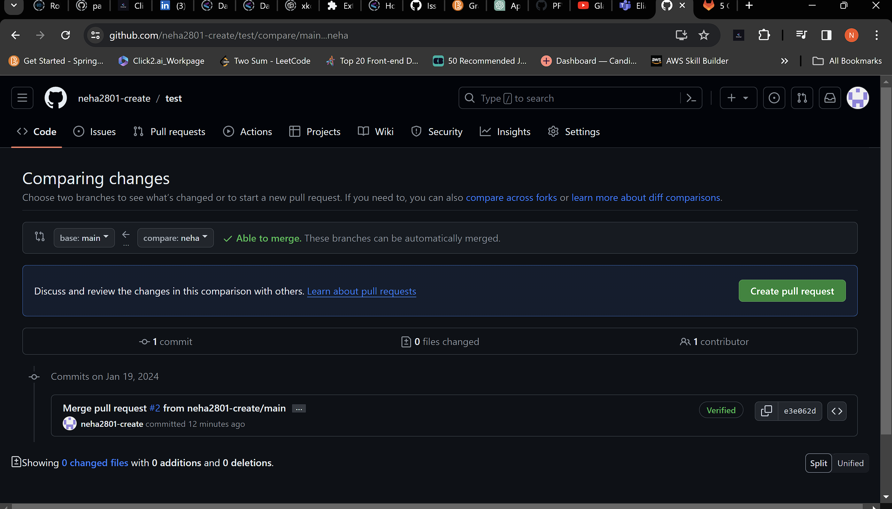
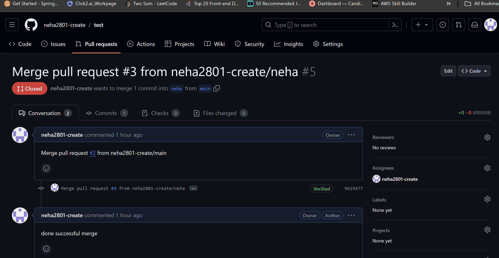
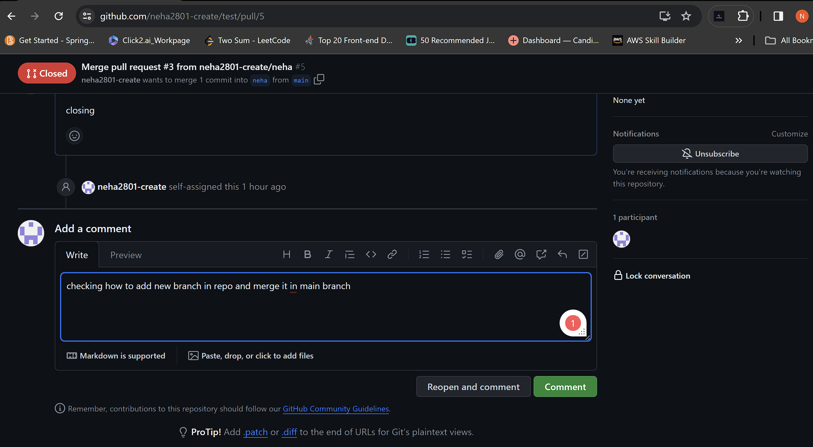
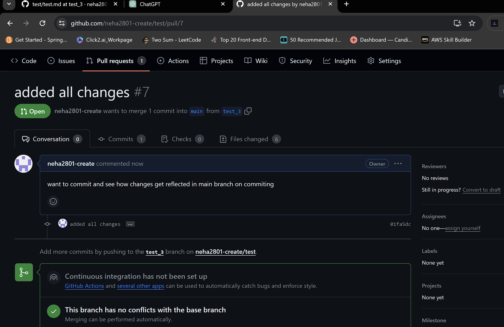
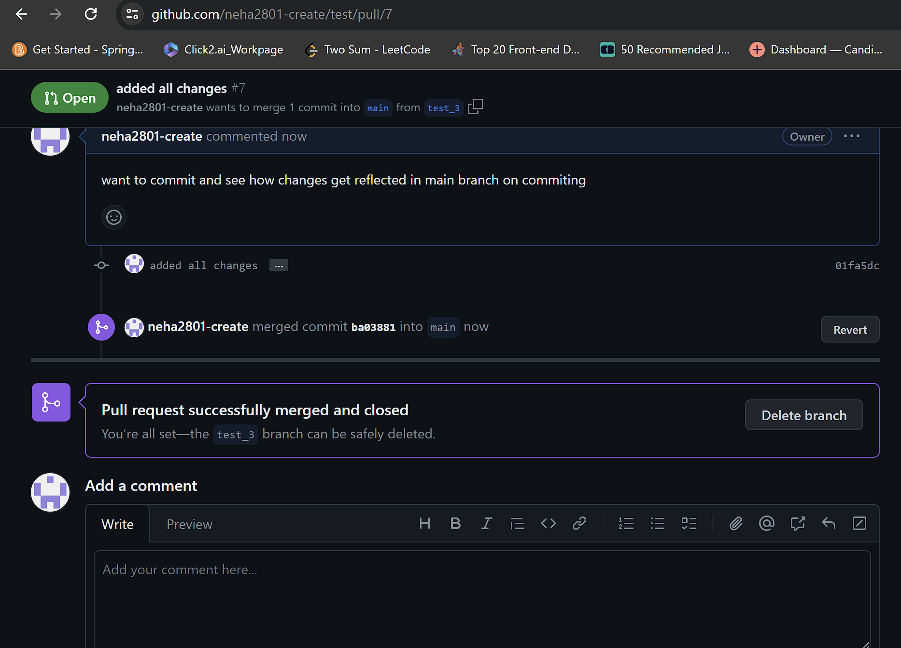
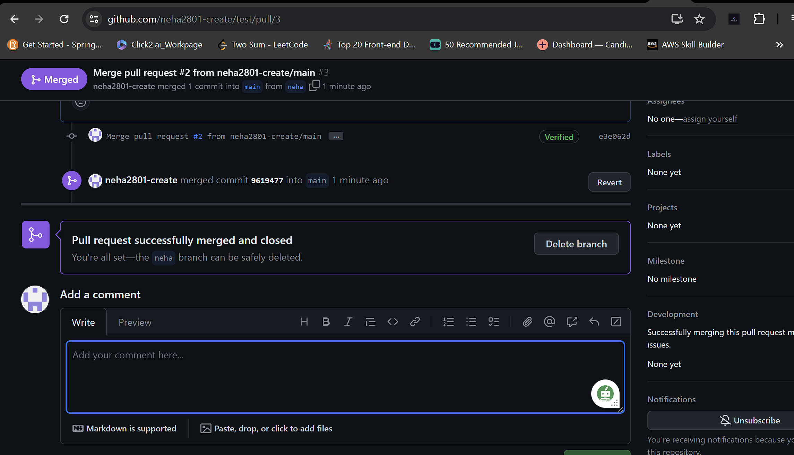

#Learning Git Hub, Github desktop fundamentals

What I learned today?

Answer:
How to pull request and close that request after merging it in main repo.

Steps :

Step 1: Go to Pull requests tab on main page of repository :

Step 2: It shows New Pull Request button at top right corner as shown below:

Step 3:
Hi 

Step 4:

Step 5: Tap create  pull request button at top right corner 

Step 6: Here we can see that open new request which we created just now

Step 7: Tap on create pull request :

Step 8:Merge pull request #2 meaans 2nd pull request done :

Step 9 : Tap merge pull request 

Step 10: Now tap Confirm Merge button :

Step 11: It shows pull request successfully merged and closed :

